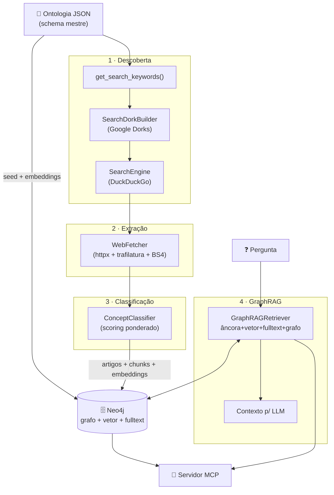
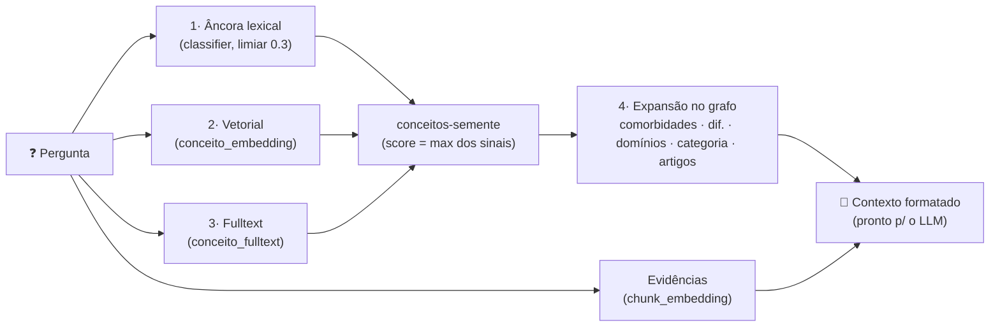
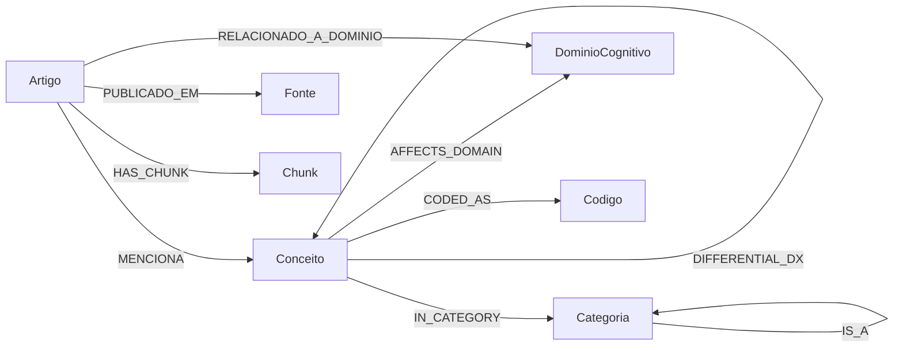

# 🧠 NeuroMCP — Crawler, Ontologia & GraphRAG de Neurodivergência

Solução completa e **end-to-end** para **descobrir, extrair, classificar, armazenar e consultar** conhecimento sobre neurodivergências (TDAH, TEA, Dislexia, Discalculia, Bipolaridade, Borderline, TOC, Tourette, Superdotação, e outros) em um **banco de dados em grafo Neo4j**, com uma camada de **GraphRAG** (Retrieval-Augmented Generation sobre grafo) pronta para ser exposta via **servidor MCP** (Model Context Protocol).

> **Filosofia**: modelamos neurodivergência sob o **paradigma da neurodiversidade** — cada condição tem `caracteristicas` **e** `pontosFortes`. Rótulos clínicos (DSM-5-TR / CID-10 / CID-11) são metadados de interoperabilidade, não juízos de valor. **Rotulamos conteúdo, nunca pessoas.**

---

## 📑 Índice

1. [Visão geral](#1-visão-geral)
2. [Arquitetura](#2-arquitetura)
3. [Stack de tecnologias](#3-stack-de-tecnologias-o-quê-e-por-quê)
4. [Estrutura do projeto](#4-estrutura-do-projeto)
5. [A ontologia](#5-a-ontologia-o-schema-mestre)
6. [Algoritmos e heurísticas (detalhado)](#6-algoritmos-e-heurísticas-detalhado)
7. [Modelo de grafo no Neo4j](#7-modelo-de-grafo-no-neo4j)
8. [GraphRAG: por que só Neo4j (sem banco vetorial)](#8-graphrag-por-que-só-neo4j-sem-banco-vetorial)
9. [Passo a passo de instalação e uso](#9-passo-a-passo-de-instalação-e-uso)
10. [Referência da CLI](#10-referência-da-cli)
11. [Servidor MCP](#11-servidor-mcp)
12. [Consultas Cypher de exemplo](#12-consultas-cypher-de-exemplo)
13. [Configuração (variáveis de ambiente)](#13-configuração-variáveis-de-ambiente)
14. [Testes](#14-testes)
15. [Solução de problemas](#15-solução-de-problemas)
16. [Limitações e avisos éticos](#16-limitações-e-avisos-éticos)

---

## 1. Visão geral

O NeuroMCP resolve quatro problemas encadeados:

| Etapa | O que faz | Módulo |
| :-- | :-- | :-- |
| **1. Descoberta** | Gera *Google Dorks* a partir da ontologia e busca URLs candidatas | `crawler/search.py` |
| **2. Extração** | Baixa cada página e extrai o texto limpo (sem menus/ads) | `crawler/fetcher.py` |
| **3. Classificação** | Pontua o texto contra a ontologia (algoritmo ponderado) | `crawler/classifier.py` |
| **4. Persistência + RAG** | Grava no grafo Neo4j e permite consulta via GraphRAG/MCP | `crawler/database.py`, `graphrag/`, `mcp_server/` |

Há dois caminhos de ingestão:

- **Online** (`--crawl`): descobre URLs na web e raspa conteúdo real.
- **Offline** (`--ingest-samples`): usa um corpus de amostra embutido (12 documentos PT-BR) — reproduzível, sem depender de rede, ideal para testes e demonstração.

---

## 2. Arquitetura



**Fluxo resumido:** a ontologia alimenta tanto a **descoberta** (palavras-chave → dorks) quanto a **classificação** (regras de match) e o **seed** do grafo. Artigos coletados viram nós `:Artigo` + `:Chunk` (com embeddings). Na consulta, o `GraphRAGRetriever` combina 4 sinais dentro do próprio Neo4j e devolve um contexto pronto para o LLM — exposto ao mundo pelo servidor MCP.

---

## 3. Stack de tecnologias (o quê e por quê)

### Núcleo (sempre instalado)

| Tecnologia | Papel no projeto | Por que esta escolha |
| :-- | :-- | :-- |
| **Python 3.10+** | Linguagem base | Ecossistema maduro para dados/NLP/grafos |
| **`uv` (Astral)** | Gerenciador de pacotes/venv | Escrito em Rust; substitui pip+virtualenv+poetry; resolução e instalação ultrarrápidas e reprodutíveis via `uv.lock` |
| **Neo4j 5.26 (Community)** | Banco de dados em grafo | Grafo nativo + **índice vetorial nativo (HNSW)** + fulltext (Lucene) + APOC. Dispensa banco vetorial externo |
| **Docker Compose** | Orquestração do Neo4j | Sobe o banco com um comando, com APOC e healthcheck |
| **`neo4j` (driver 5.x)** | Conexão Bolt transacional | Driver oficial; sessões, parâmetros, `verify_connectivity` |
| **`pydantic` v2** | Modelagem/validação de dados | Tipagem forte em toda a esteira (`Concept`, `CrawledArticle`, resultados do RAG) |
| **`httpx`** | Cliente HTTP assíncrono | HTTP/2, pooling, redirects, timeouts — raspagem concorrente |
| **`trafilatura`** | Extração de conteúdo principal | Estado da arte para separar artigo de "boilerplate" (menu/rodapé/ads) |
| **`beautifulsoup4` + `lxml`** | Fallback de extração | Quando o trafilatura extrai pouco, faz parsing DOM e remove `script/nav/footer/...` |
| **`duckduckgo-search`** | Motor de busca | Resolve os dorks **sem API key** nem custo |
| **`unidecode`** | Normalização textual | Remove acentos → casamento robusto (`déficit`→`deficit`) |
| **`rich`** | CLI/relatórios | Tabelas e painéis coloridos, legíveis |
| **`tenacity`** | Retentativas resilientes | Backoff em operações de rede sujeitas a falha transitória |

### Extras opcionais

| Extra | Instala | Habilita |
| :-- | :-- | :-- |
| `embeddings` | `sentence-transformers` (+ torch) | Embeddings **semânticos** locais (multilíngue, forte em PT-BR) |
| `mcp` | `mcp[cli]` (SDK oficial) | O **servidor MCP** (`neuro-mcp`) via FastMCP |

### Desenvolvimento

`pytest` + `pytest-asyncio` — suíte de testes (offline + integração com Neo4j).

---

## 4. Estrutura do projeto

```
neuromcp/
├── docker-compose.yml           # Neo4j 5.26 + APOC + healthcheck
├── pyproject.toml               # deps, extras, scripts, config de build/pytest
├── .env.example                 # variáveis de conexão e embeddings
├── scripts/
│   └── run_local.sh             # sobe tudo e roda uma consulta GraphRAG (1 comando)
├── ontologia/
│   └── ontologia_neurodivergencia.json   # SCHEMA MESTRE (37 conceitos, 25 relações)
├── crawler/                     # pacote do crawler + ingestão
│   ├── config.py                # Settings (Neo4j, timeouts, embeddings, chunking)
│   ├── models.py                # modelos Pydantic
│   ├── ontology.py              # parser/índice da ontologia + normalize_text()
│   ├── search.py                # SearchDorkBuilder + SearchEngine (DuckDuckGo)
│   ├── fetcher.py               # WebFetcher (httpx + trafilatura + BS4)
│   ├── classifier.py            # ConceptClassifier (scoring ponderado)  ⭐ heurística
│   ├── embeddings.py            # provedores plugáveis (ST / Ollama / hashing)
│   ├── chunking.py              # fatiamento com sobreposição e corte suave
│   ├── database.py              # Neo4jRepository (seed, índices, save_article)
│   ├── sample_corpus.py         # 12 documentos PT-BR para ingestão offline
│   ├── pipeline.py              # orquestra descoberta→raspagem→classificação→Neo4j
│   └── cli.py                   # `uv run crawler ...`
├── graphrag/
│   └── retriever.py             # GraphRAGRetriever (recuperação híbrida)  ⭐ heurística
├── mcp_server/
│   └── server.py                # servidor MCP (6 ferramentas)
└── tests/                       # 15 testes offline + integração Neo4j (auto-skip)
```

---

## 5. A ontologia (o schema mestre)

O arquivo [`ontologia/ontologia_neurodivergencia.json`](ontologia/ontologia_neurodivergencia.json) é a **fonte única de verdade**. Números atuais: **37 conceitos**, **11 categorias**, **13 domínios cognitivos**, **25 relações explícitas**.

### Blocos principais

| Bloco | Conteúdo |
| :-- | :-- |
| `meta` | versão, padrões referenciados (DSM-5-TR/CID-10/CID-11), paradigma, aviso |
| `dominiosCognitivos` | Atenção, Funções Executivas, Memória de Trabalho, Regulação Emocional, Cognição Social, Processamento Sensorial, etc. |
| `categorias` | Neurodesenvolvimento, Aprendizagem, Comunicação, Humor, Personalidade, Ansiedade, Trauma, etc. (com hierarquia via `superClasse`) |
| `conceitos` | as neurodivergências (ver campos abaixo) |
| `relacoes` | arestas globais: `COMORBIDO_COM`, `DIAG_DIFERENCIAL` (com `forca`, `prevalenciaAprox`) |
| `crawler` | **regras de match**: `pesos`, `limiteConfiancaMinima`, `sinaisDeContexto`, normalização |
| `modeloGrafo` | mapeamento nós/arestas → Neo4j (guia de ETL) |

### Anatomia de um conceito (ex.: `nd:tdah`)

```jsonc
{
  "id": "nd:tdah",
  "rotuloPt": "Transtorno do Déficit de Atenção e Hiperatividade",
  "rotuloEn": "Attention-Deficit/Hyperactivity Disorder",
  "sigla": ["TDAH", "ADHD"],
  "sinonimos": ["déficit de atenção", "hipercinesia", "TDA"],
  "grafiasComuns": ["tdha", "adhd"],          // erros de digitação comuns
  "categoria": "cat:neurodesenvolvimento",
  "superClasse": "cat:neurodesenvolvimento",
  "subClasses": ["nd:tdah-desatento", "nd:tdah-hiperativo", "nd:tdah-combinado"],
  "statusInclusao": "nucleo",                 // nucleo | comum | contestado
  "definicao": "...",
  "codigos": { "dsm5": "314.0x / F90.x", "cid10": "F90", "cid11": "6A05" },
  "dominiosAfetados": ["dom:atencao", "dom:funcoes-executivas", ...],
  "caracteristicas": ["desatenção", "hiperatividade", "impulsividade", ...],
  "pontosFortes": ["criatividade", "hiperfoco", "pensamento divergente", ...],
  "comorbidadesComuns": ["nd:tea", "nd:dislexia", ...],
  "diagnosticoDiferencial": ["nd:tea", "nd:bipolar", ...],
  "palavrasChave": { "pt": ["tdah", "hiperfoco", ...], "en": ["adhd", ...] },
  "hashtags": ["#tdah", "#adhd", "#neurodivergente"]
}
```

O campo **`statusInclusao`** é honesto sobre o debate do campo: `nucleo` (consenso), `comum` (amplamente aceito), `contestado` (inclusão debatida — ex.: depressão, ansiedade, PAS, esquizofrenia).

---

## 6. Algoritmos e heurísticas (detalhado)

Esta é a seção-chave. Cada sub-tópico descreve **o algoritmo, a heurística e o porquê**.

### 6.1 Normalização textual (`ontology.normalize_text`)

Toda comparação textual passa por três passos determinísticos:

```
texto → lower()  →  unidecode()  →  colapsar espaços (regex \s+ → " ")  →  strip()
```

- **`lower()`**: casamento insensível a maiúsculas.
- **`unidecode()`**: transliteração para ASCII (`"Déficit de Atenção"` → `"deficit de atencao"`). Elimina divergências por acento/diacrítico — uma fonte enorme de falso-negativo em PT-BR.
- **Colapso de espaços**: normaliza quebras de linha, tabs e espaços múltiplos.

**Por quê:** garante que `"TDAH"`, `"tdah"` e `"Tdah"` — e `"déficit"`/`"deficit"` — casem com o mesmo termo da ontologia.

### 6.2 Classificador ponderado (`classifier.ConceptClassifier`) ⭐

O coração da classificação. Para **cada conceito** da ontologia, acumula um **score** a partir de **6 sinais**, cada um com um peso (definidos em `crawler.estrategiaDeMatch.pesos` no JSON):

| # | Sinal | Peso | Casamento | Regra especial |
| :-: | :-- | :-: | :-- | :-- |
| 1 | **Sigla** | **1.0** | `\bSIGLA\b` (limite de palavra, regex) | **×1.2** se a sigla aparece no **título**; `break` no 1º match |
| 2 | **Rótulo PT** | **0.9** | substring | **×1.2** se no título |
| 3 | **Sinônimos** | **0.8** | substring | pega o `max` entre os sinônimos |
| 4 | **Palavras-chave** (pt+en) | **0.7** | substring | **bônus por quantidade** (ver fórmula) |
| 5 | **Hashtags** | **0.6** | substring | `break` no 1º match |
| 6 | **Grafias comuns** | **0.5** | substring | **acumulativo** (cada erro de digitação soma) |

**Por que limite de palavra só nas siglas?** Siglas são curtas e ambíguas (ex.: "TEA" poderia casar dentro de "plaTEAu"). O `\b...\b` evita casamento interno. Rótulos e sinônimos são longos o bastante para usar substring com segurança.

**Bônus de título (×1.2):** se o termo aparece no **título**, o documento é provavelmente *sobre* aquele conceito (não uma menção de passagem). Heurística de relevância editorial.

**Fórmula do bônus de palavras-chave** (recompensa densidade de vocabulário):

```
peso_kw = 0.7 × min(1.3, 0.7 + 0.1 × nº_de_keywords_encontradas)
```

| keywords encontradas | multiplicador | peso_kw |
| :-: | :-: | :-: |
| 1 | 0.8 | 0.56 |
| 3 | 1.0 | 0.70 |
| 6+ | 1.3 (teto) | 0.91 |

**Normalização da confiança** para a escala [0, 1]:

```
score_total = peso_sigla + peso_rotulo + peso_sinonimo + peso_kw + peso_hashtag + Σ grafias
confianca   = min(1.0, score_total / 2.2)
```

O divisor **2.2** calibra o score bruto (que pode passar de 3.5 com múltiplos sinais fortes) para uma confiança interpretável. **Aceita-se o match se `confianca ≥ 0.6` (o `limiteConfiancaMinima`) E houver ao menos 1 termo encontrado.** Os matches são ordenados por confiança decrescente.

**Exemplo resolvido** — texto: *"O TDAH está associado à disfunção executiva"*, título: *"TDAH"*:

| Sinal | Cálculo | Valor |
| :-- | :-- | :-: |
| Sigla `TDAH` | 1.0 × 1.2 (no título) | 1.20 |
| Palavras-chave | "tdah" + "função executiva"¹ = 2 kw → 0.7×0.9 | 0.63 |
| **score_total** | 1.20 + 0.63 | **1.83** |
| **confiança** | min(1, 1.83 / 2.2) | **0.83** ✅ |

> ¹ `"função executiva"` (normalizada `funcao executiva`) é substring de `"disfunção executiva"` (`disfuncao executiva`).

### 6.3 Detecção de sinais de contexto (`detect_context_signals`)

Além de *o que* o texto fala, detecta *de que ângulo*. A ontologia define três contextos em `sinaisDeContexto`:

- **`clinico`**: "diagnóstico", "cid", "dsm", "tratamento", "sintoma", "comorbidade"
- **`educacional`**: "escola", "sala de aula", "aprendizagem", "acomodação", "professor", "aluno"
- **`identidade`**: "neurodivergente", "neurodiversidade", "comunidade", "orgulho", "identidade"

**Heurística:** se **≥ 1** palavra-sinal (normalizada) aparece no texto, o contexto é marcado. Serve para rotear/filtrar conteúdo (ex.: só material clínico) e enriquecer o nó `:Artigo`.

### 6.4 Extração de evidências (`extract_evidence_snippets`)

Para cada conceito casado, captura **até 3 trechos** que justificam o match:

1. Quebra o texto em sentenças por `[\n.?!]+`, mantendo linhas com **> 30 caracteres** (descarta fragmentos).
2. Para cada linha, se **qualquer** termo encontrado aparece nela → vira snippet (até 250 chars).
3. Para no 3º snippet.

**Por quê:** rastreabilidade. No grafo, a aresta `:MENCIONA` guarda esses trechos — você sabe *por que* um artigo foi ligado a um conceito.

### 6.5 Construção de Google Dorks (`search.SearchDorkBuilder`)

Gera consultas de busca avançadas, especializadas por tipo de fonte (`SITE_FILTERS`):

| Fonte | Filtros | Template |
| :-- | :-- | :-- |
| **Artigo científico** | `site:pubmed...`, `site:scielo.br`, `site:arxiv.org`, `filetype:pdf site:edu.br` | `{site} "{kw}" (pesquisa OR estudo OR artigo)` |
| **Blog** | `site:medium.com`, `inurl:blog`, `inurl:artigo` | `{site} "{kw}" neurodivergente OR neurodiversidade` |
| **Fórum** | `site:reddit.com/r/autism`, `site:reddit.com/r/ADHD`, `site:quora.com` | `{site} "{kw}" experiencia OR relato` |
| **Website** | `site:org.br`, `site:gov.br`, `site:abda.org.br` | `"{kw}" neurodivergencia OR "neurodiversidade"` |

**Heurísticas:** palavras-chave com espaço são colocadas entre aspas (busca por frase exata); os filtros de site são rotacionados (`i % len(site_list)`) para diversificar as fontes; termos booleanos (`OR`) ampliam o recall. As `keywords` vêm de `get_search_keywords()`, que junta rótulos, siglas (len ≥ 3, evitando ruído) e as 3 primeiras palavras-chave de cada conceito.

### 6.6 Extração de conteúdo (`fetcher.WebFetcher`)

Pipeline de extração com **degradação em cascata**:

1. **httpx** baixa o HTML (assíncrono, `follow_redirects`, timeout, `verify=False` para repositórios acadêmicos com certificado problemático).
2. **`trafilatura.bare_extraction`** — extrai artigo principal + metadados (título, autor, data). Em fóruns, inclui comentários.
3. Se vier pouco texto → **`trafilatura.extract`** (modo simples).
4. Se ainda insuficiente (< 150 chars) → **BeautifulSoup/lxml**: remove `script/style/nav/footer/header/aside/form` e concatena `<p>` com > 20 chars.
5. **Guarda de qualidade:** descarta a página se o texto final tiver < 80 chars.

**Por quê a cascata:** trafilatura acerta na maioria; o fallback BS4 salva páginas com estrutura atípica. As guardas evitam poluir o grafo com páginas vazias/erro.

### 6.7 Chunking com sobreposição e corte suave (`chunking.split_into_chunks`)

Fatia o texto do artigo em janelas para a recuperação semântica:

- **Janela** de `chunk_size` ≈ **900 caracteres**, com **sobreposição** de **150** (`overlap`).
- **Corte suave:** em vez de cortar no meio de uma frase, procura o último fim de sentença (`". "`, `"! "`, `"? "`) dentro da janela; usa-o se estiver além de **50%** da janela.
- **Sobreposição** preserva contexto entre chunks vizinhos (evita partir uma ideia exatamente na fronteira → melhora o recall vetorial).

Cada chunk vira um nó `:Chunk` com seu próprio `embedding`, ligado ao artigo por `HAS_CHUNK`.

### 6.8 Embeddings plugáveis (`embeddings.py`)

Interface única (`EmbeddingProvider`) com três implementações. **Todos os vetores são L2-normalizados**, então **cosseno = produto interno**.

| Provedor | Tipo | Dim | Quando usar |
| :-- | :-- | :-: | :-- |
| **`sentence-transformers`** | Semântico local (MiniLM multilíngue) | 384 | **Produção** (recomendado). `uv sync --extra embeddings` |
| **`ollama`** | Semântico local (`nomic-embed-text`) | 768 | Se você já roda Ollama |
| **`hashing`** | Lexical determinístico (**feature hashing**) | 384 | Testes/CI e demonstração offline (**padrão de fallback**) |

**Algoritmo do fallback `hashing`** (o *hashing trick*):

1. Tokeniza o texto normalizado em **unigramas + bigramas** de palavras (`[a-z0-9]+`).
2. Para cada token: `md5(token)` → 4 primeiros bytes viram **índice** (`mod dim`); o 5º byte define o **sinal** (`±1`).
3. Acumula no vetor e **L2-normaliza**.

É **determinístico** e captura **sobreposição de vocabulário** (bag-of-words com sinal), mas **não é semântico** — serve para validar o *encanamento* do GraphRAG sem baixar modelos nem depender de rede. A fábrica `get_embedding_provider("auto")` tenta ST → Ollama → cai para hashing, avisando no log.

### 6.9 Índice vetorial nativo (HNSW) + similaridade de cosseno

Os embeddings ficam em **propriedades dos nós** (`:Conceito.embedding`, `:Chunk.embedding`) e são indexados por um **índice vetorial nativo do Neo4j** (HNSW — *Hierarchical Navigable Small World*, via Apache Lucene), com **função de similaridade cosseno**. A busca:

```cypher
CALL db.index.vector.queryNodes('chunk_embedding', $k, $vetorConsulta)
YIELD node, score
```

**HNSW** é um algoritmo de *Approximate Nearest Neighbors* (ANN) baseado em grafo de navegação em múltiplas camadas — busca em tempo ~logarítmico, sem varredura linear. É o que torna a busca vetorial rápida **dentro** do Neo4j.

### 6.10 GraphRAG: recuperação híbrida + expansão no grafo (`graphrag/retriever.py`) ⭐

O `GraphRAGRetriever.retrieve()` combina **4 sinais** e depois **expande no grafo** — tudo no mesmo banco:



1. **Âncora lexical** — reusa o `ConceptClassifier` num limiar baixo (**0.3**) para ancorar conceitos citados na pergunta. Funciona **mesmo sem embeddings** (robusto/offline).
2. **Vetorial** — `queryNodes` sobre `conceito_embedding`.
3. **Fulltext** — `queryNodes` sobre `conceito_fulltext` (query Lucene, ver 6.11).
4. **Fusão de score:** para cada conceito, `score = max` entre os sinais; guarda a **proveniência** (`via = [ancora|vetor|fulltext|grafo]`). Os melhores viram **sementes**.
5. **Expansão no grafo** (a etapa "Graph"): para cada semente, percorre **comorbidades, diagnóstico diferencial, domínios cognitivos, categoria e contagem de artigos**. É isso que diferencia GraphRAG de um RAG vetorial puro — traz o **conhecimento estruturado e as relações**, não só textos parecidos.
6. **Evidências textuais:** busca vetorial em `:Chunk` traz trechos reais de artigos, com fonte, para citação.
7. **Montagem do contexto** (`build_context`): gera um Markdown com definição, domínios, comorbidades (com força), diagnóstico diferencial, pontos fortes, evidências `[n]` e uma **instrução** ("responda só com o contexto; cite fontes; rotule conteúdo, não pessoas").

**Degradação graciosa (heurística de resiliência):** se o Neo4j estiver **fora ou vazio**, `expand_concepts` falha → o retriever cai para `_local_expand`, que reconstrói a vizinhança **a partir da própria ontologia JSON** (comorbidades, domínios, diagnóstico diferencial, com `forca` das `relacoes`). Ou seja, o GraphRAG **sempre responde** algo útil, mesmo sem banco.

### 6.11 Query Lucene (`_lucene_query`)

Para o fulltext, a pergunta é sanitizada (escape de caracteres especiais do Lucene: `+ - ! ( ) { } [ ] ^ " ~ * ? : \ /` e `&& ||`), as palavras com **≥ 3 letras** são extraídas e unidas por **`OR`**. Evita erro de sintaxe e maximiza recall.

---

## 7. Modelo de grafo no Neo4j



### Nós e propriedades-chave

| Rótulo | Origem | Propriedades relevantes |
| :-- | :-- | :-- |
| `:Conceito` | ontologia | `id`, `rotuloPt/En`, `statusInclusao`, `definicao`, `sigla`, `sinonimos`, `pontosFortes`, `textoIndexavel`, **`embedding`** |
| `:Categoria` | ontologia | `id`, `rotuloPt/En` |
| `:DominioCognitivo` | ontologia | `id`, `rotuloPt/En` |
| `:Codigo` | ontologia | `id` (`cod:sistema:valor`), `sistema`, `valor` |
| `:Artigo` | crawler | `url` (único), `titulo`, `conteudoTexto`, `tipoFonte`, `resumo`, `autores`, `contextosDetectados` |
| `:Fonte` | crawler | `dominio` (único), `tipoFonte` |
| `:Chunk` | crawler | `id`, `texto`, `ordem`, **`embedding`** |

### Arestas

`IS_A` · `SUBTYPE_OF` · `IN_CATEGORY` · `AFFECTS_DOMAIN` · `COMORBID_WITH` (`forca`, `prevalenciaAprox`) · `DIFFERENTIAL_DX` · `CODED_AS` · `PUBLICADO_EM` · `MENCIONA` (`confianca`, `trechosEvidencia`) · `RELACIONADO_A_DOMINIO` · `HAS_CHUNK`

### Índices e restrições (criados no seed)

| Objeto | Tipo | Alvo |
| :-- | :-- | :-- |
| `conceito_id`, `categoria_id`, `dominio_id`, `codigo_id`, `artigo_url`, `fonte_dominio`, `chunk_id` | CONSTRAINT (unicidade) | ids/urls |
| `conceito_embedding`, `chunk_embedding` | **VECTOR** (HNSW, cosine) | `.embedding` |
| `conceito_fulltext` | FULLTEXT | `(:Conceito).textoIndexavel` |
| `artigo_fulltext` | FULLTEXT | `(:Artigo)` título+texto |
| `chunk_fulltext` | FULLTEXT | `(:Chunk).texto` |

---

## 8. GraphRAG: por que só Neo4j (sem banco vetorial)

**Pergunta avaliada:** *o GraphRAG precisa de um banco vetorial dedicado (Qdrant/Pinecone/Weaviate)?* → **Não, o Neo4j basta.**

O Neo4j 5.x tem **índice vetorial nativo (HNSW/Lucene)** e **fulltext (BM25)** no mesmo banco do grafo. Vantagens de manter tudo no Neo4j:

- **Uma única viagem ao banco** faz busca vetorial **e** travessia de grafo — sem *double-hop* entre dois sistemas.
- **Sem silos** grafo↔vetores: elimina o antipadrão de sincronizar dois stores (dobra latência e complexidade operacional).
- **Consistência transacional**: embeddings e relações vivem juntos, atualizados na mesma transação.

Um banco vetorial dedicado só compensaria em **escala de centenas de milhões de vetores** ou requisitos de ANN muito especializados — **não é o caso** de uma ontologia de domínio com um crawler alimentando documentos.

> Fontes: [Neo4j — Native Vector Data Type](https://neo4j.com/blog/developer/introducing-neo4j-native-vector-data-type/) · [Cypher Manual — Vector indexes](https://neo4j.com/docs/cypher-manual/current/indexes/semantic-indexes/vector-indexes/) · [neo4j-graphrag-python](https://neo4j.com/docs/neo4j-graphrag-python/current/user_guide_rag.html)

---

## 9. Passo a passo de instalação e uso

### Pré-requisitos

- **Docker** + **Docker Compose**
- **`uv`** (`curl -LsSf https://astral.sh/uv/install.sh | sh`)

### Caminho rápido (um comando)

```bash
./scripts/run_local.sh
```

Ele sobe o Neo4j, aguarda ficar saudável, instala dependências, semeia a ontologia, ingere o corpus de amostra (com chunks/embeddings) e roda uma consulta GraphRAG de exemplo.

### Passo a passo manual

**1) Subir o Neo4j**

```bash
docker compose up -d
```

- Neo4j Browser: <http://localhost:7474>
- Bolt: `bolt://localhost:7687`
- Login: `neo4j` / `neurodivergencia123`

**2) Instalar dependências**

```bash
uv sync                       # núcleo
uv sync --extra mcp           # + servidor MCP
uv sync --extra embeddings    # + embeddings semânticos (baixa torch/modelo)
```

**3) (Opcional) Configurar ambiente**

```bash
cp .env.example .env
# para GraphRAG semântico de verdade:
export NEURO_EMBEDDING_PROVIDER=sentence-transformers
```

**4) Popular o grafo**

```bash
# OFFLINE (reproduzível, sem rede) — recomendado para começar
uv run crawler --ingest-samples

# OU ONLINE (raspa a web de verdade)
uv run crawler --full --max-results 5
```

**5) Consultar via GraphRAG**

```bash
uv run crawler --graphrag "Quais as comorbidades do TDAH e como diferenciar de bipolaridade?"
```

**6) (Opcional) Subir o servidor MCP**

```bash
uv run neuro-mcp
```

---

## 10. Referência da CLI

`uv run crawler [opções]`

| Flag | Descrição |
| :-- | :-- |
| `--seed-ontology` | Semeia a ontologia (nós, arestas, índices, embeddings de conceito) no Neo4j |
| `--crawl` | Descobre URLs (dorks) + raspa + classifica + grava |
| `--full` | `--seed-ontology` + `--crawl` |
| `--ingest-samples` | **Ingestão OFFLINE** do corpus de amostra (semeia + artigos + chunks/embeddings) |
| `--graphrag "PERGUNTA"` | Consulta GraphRAG; imprime o contexto recuperado |
| `--query "TERMO"` | Busca personalizada por termo/dork |
| `--sources ...` | Filtra fontes: `artigo_cientifico blog forum website` |
| `--max-results N` | Máx. de resultados por dork (padrão 5) |
| `--no-embeddings` | Desliga embeddings/chunks (grafo sem busca vetorial) |
| `--neo4j-uri/user/password` | Sobrescreve a conexão |
| `-v, --verbose` | Log detalhado |

---

## 11. Servidor MCP

Expõe o GraphRAG como **ferramentas MCP** (somente leitura) para qualquer cliente (Claude Code/Desktop, etc.).

```bash
uv sync --extra mcp
uv run neuro-mcp      # transporte stdio
```

| Ferramenta | O que faz |
| :-- | :-- |
| `responder_com_graphrag(pergunta, top_k_chunks, top_k_conceitos)` | Recuperação híbrida completa; retorna conceitos + evidências + `contextoFormatado` |
| `buscar_conceito(termo)` | Resolve termo (id/rótulo/sigla/sinônimo) e devolve a vizinhança no grafo |
| `comorbidades(conceito_id)` | Comorbidades frequentes de um conceito |
| `listar_conceitos(categoria?)` | Lista conceitos (opcionalmente por categoria) |
| `artigos_do_conceito(conceito_id, limite)` | Artigos coletados que mencionam o conceito |
| `estatisticas_grafo()` | Contagens de nós e arestas |

Configuração em um cliente MCP (`.mcp.json`):

```json
{
  "mcpServers": {
    "neuromcp-graphrag": {
      "command": "uv",
      "args": ["run", "neuro-mcp"],
      "cwd": "/caminho/para/neuromcp",
      "env": { "NEO4J_PASSWORD": "neurodivergencia123", "NEURO_EMBEDDING_PROVIDER": "auto" }
    }
  }
}
```

### Acesso remoto (ngrok + Mistral AI)

O transporte **stdio** é local. Para usar o servidor como **conector MCP remoto** (ex.: no chat do **Mistral AI**), rode-o em **HTTP (Streamable HTTP)** e exponha via **ngrok**:

```bash
# pré-requisitos: ngrok autenticado (ngrok config add-authtoken <TOKEN>), Neo4j no ar e populado
./scripts/mcp_ngrok.sh
```

O script: (1) sobe o servidor em HTTP (`neuro-mcp --transport http`), (2) abre o túnel ngrok, (3) descobre a URL pública (via API local do ngrok em `:4040`) e imprime o **endpoint MCP** — algo como `https://xxxx.ngrok-free.app/mcp`.

No Mistral (Le Chat / La Plateforme), adicione um **servidor MCP remoto (HTTP/Streamable HTTP)** e cole essa URL. As 6 ferramentas ficam disponíveis.

Também é possível rodar o HTTP manualmente:

```bash
uv run neuro-mcp --transport http --host 127.0.0.1 --port 8000 --path /mcp
```

Variáveis: `NEURO_MCP_PORT` (8000), `NEURO_MCP_PATH` (/mcp), `NEURO_MCP_TRANSPORT` (`http` | `sse` | `stdio`).

> ⚠️ **Segurança:** no modo HTTP a proteção contra DNS-rebinding é desligada (o Host do ngrok é dinâmico) e **qualquer pessoa com a URL pode consultar** o servidor — que é **somente-leitura** sobre a ontologia/artigos. A URL do ngrok gratuito é pública e efêmera; **encerre o túnel (Ctrl+C) ao terminar**. Não exponha dados sensíveis por este caminho.

---

## 12. Consultas Cypher de exemplo

Acesse <http://localhost:7474> e rode:

**Artigos que mencionam TDAH ou TEA, com evidências**

```cypher
MATCH (a:Artigo)-[r:MENCIONA]->(c:Conceito)
WHERE c.id IN ['nd:tdah', 'nd:tea']
RETURN a.titulo, a.url, c.rotuloPt, r.confianca, r.trechosEvidencia
ORDER BY r.confianca DESC;
```

**Rede de comorbidades do TDAH (com força)**

```cypher
MATCH (:Conceito {id:'nd:tdah'})-[r:COMORBID_WITH]-(c:Conceito)
RETURN c.rotuloPt, r.forca, r.prevalenciaAprox;
```

**Busca vetorial semântica em chunks (GraphRAG na unha)**

```cypher
CALL db.index.vector.queryNodes('chunk_embedding', 5, $vetorConsulta)
YIELD node, score
MATCH (a:Artigo)-[:HAS_CHUNK]->(node)
RETURN a.titulo, node.texto, score ORDER BY score DESC;
```

**Conceitos que afetam as Funções Executivas**

```cypher
MATCH (c:Conceito)-[:AFFECTS_DOMAIN]->(:DominioCognitivo {id:'dom:funcoes-executivas'})
RETURN c.rotuloPt;
```

**Ver os índices criados**

```cypher
SHOW INDEXES YIELD name, type, labelsOrTypes, properties;
```

---

## 13. Configuração (variáveis de ambiente)

Ver [`.env.example`](.env.example).

| Variável | Padrão | Descrição |
| :-- | :-- | :-- |
| `NEO4J_URI` | `bolt://localhost:7687` | Endereço do Bolt |
| `NEO4J_USER` | `neo4j` | Usuário |
| `NEO4J_PASSWORD` | `neurodivergencia123` | Senha (igual ao `docker-compose.yml`) |
| `NEURO_EMBEDDING_PROVIDER` | `auto` | `auto` \| `sentence-transformers` \| `ollama` \| `hashing` |
| `NEURO_EMBEDDING_DIM` | `384` | Dimensão do índice vetorial (MiniLM=384, nomic=768, hashing=384) |
| `OLLAMA_HOST` | `http://localhost:11434` | Só para o provedor `ollama` |
| `NEURO_ALLOW_INSECURE_TLS` | `0` | `1` desativa a verificação TLS na raspagem (**inseguro**, sujeito a MITM). Deixe `0` |

> ⚠️ **A dimensão do índice deve bater com o provedor.** Ao trocar de provedor com dimensão diferente, recrie os índices/embeddings (re-seed). No seed, o índice é criado com a dimensão real do embedder ativo.

---

## 14. Testes

```bash
uv run pytest -q
```

- **15 testes offline** (ontologia, integridade referencial, classificador, ancoragem, embeddings, chunking, montagem de contexto GraphRAG, corpus) — não precisam de banco.
- **2 testes de integração** (`tests/test_integration_neo4j.py`) rodam o ciclo completo (seed → ingestão → GraphRAG) e **se auto-pulam** se não houver Neo4j em `bolt://localhost:7687`.

---

## 15. Solução de problemas

| Sintoma | Causa provável | Solução |
| :-- | :-- | :-- |
| `Couldn't connect to localhost:7687` | Neo4j não está no ar | `docker compose up -d` e aguarde o healthcheck |
| GraphRAG responde sem evidências (chunks) | Grafo sem artigos/embeddings | `uv run crawler --ingest-samples` |
| Log "Usando HashingProvider (NÃO-semântico)" | `sentence-transformers` ausente | `uv sync --extra embeddings` + `NEURO_EMBEDDING_PROVIDER=sentence-transformers` |
| Erro de **dimensão** ao gravar embeddings | `NEURO_EMBEDDING_DIM` ≠ dim do provedor | Ajuste a dim e **re-seed** (recria índices) |
| `neuro-mcp: command not found` | Extra MCP não instalado | `uv sync --extra mcp` |
| MCP: `Invalid JSON: EOF ... '\n'` + `Internal Server Error` | Linha em branco no stdin (ex.: rodar o servidor e digitar Enter no terminal) | **Já tratado** — o servidor filtra linhas vazias. Não digite direto no terminal; use um cliente MCP ou o MCP Inspector |
| `--crawl` não traz resultados | Rede/anti-bot do DuckDuckGo | Reduza `--max-results`, tente `--sources`, ou use `--ingest-samples` |
| `--crawl` falha com erro de certificado TLS | Host com certificado inválido/expirado | Prefira outra fonte; em último caso, `NEURO_ALLOW_INSECURE_TLS=1` (**inseguro**) |

---

## 16. Limitações e avisos éticos

- **Não é ferramenta diagnóstica.** É um sistema de **organização e classificação de informação**. Códigos DSM/CID são indicativos e devem ser validados contra as edições oficiais.
- **Rotulamos conteúdo, não pessoas.** O classificador e o GraphRAG identificam o *tópico* de um texto — nunca inferem diagnóstico de indivíduos.
- **O corpus de amostra é ilustrativo** (domínio `neuro.exemplo.org`), sintetizado para demonstração — não são artigos reais nem fontes citáveis.
- **Respeite os termos das fontes** ao usar o modo `--crawl` (robots.txt, direitos autorais, limites de taxa).
- **Paradigma da neurodiversidade:** a modelagem preserva `pontosFortes` e distingue `statusInclusao` (núcleo/comum/contestado) para ser honesta sobre o debate do campo.

---

### Licença

Ontologia sugerida sob **CC BY-SA 4.0**. Verifique/ajuste conforme o uso pretendido.
